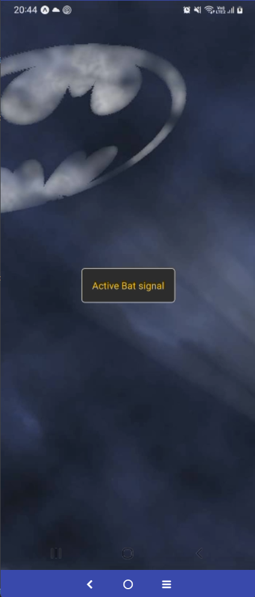
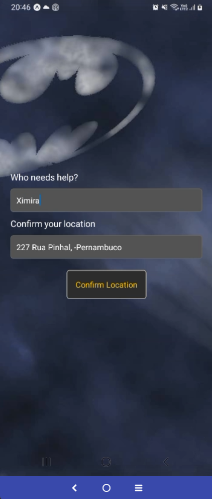

# Bat Sinal

Este projeto é um aplicativo que possue um botão com ação de localizar geograficamente o celular do usuário e enviar para o Batman.

## Como rodar o projeto

1. Certifique-se de ter o [Node.js](https://nodejs.org/) instalado em sua máquina.
2. Instale as dependências do projeto com o comando:
    ```
    npm install
    ```
3. Inicie o aplicativo com:
    ```
    npm start
    ```

## Exemplo de uso

Veja abaixo uma captura de tela do aplicativo em funcionamento:


